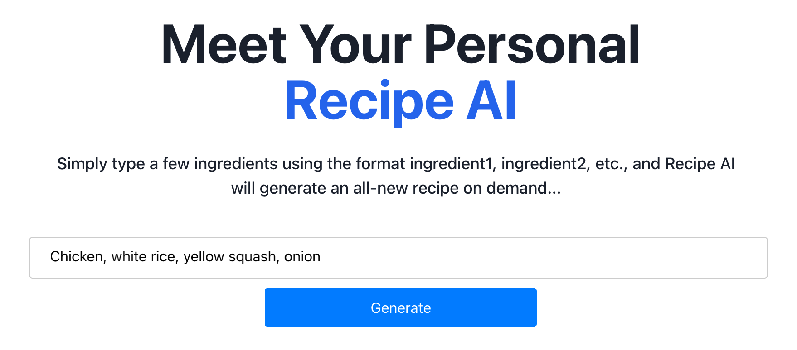
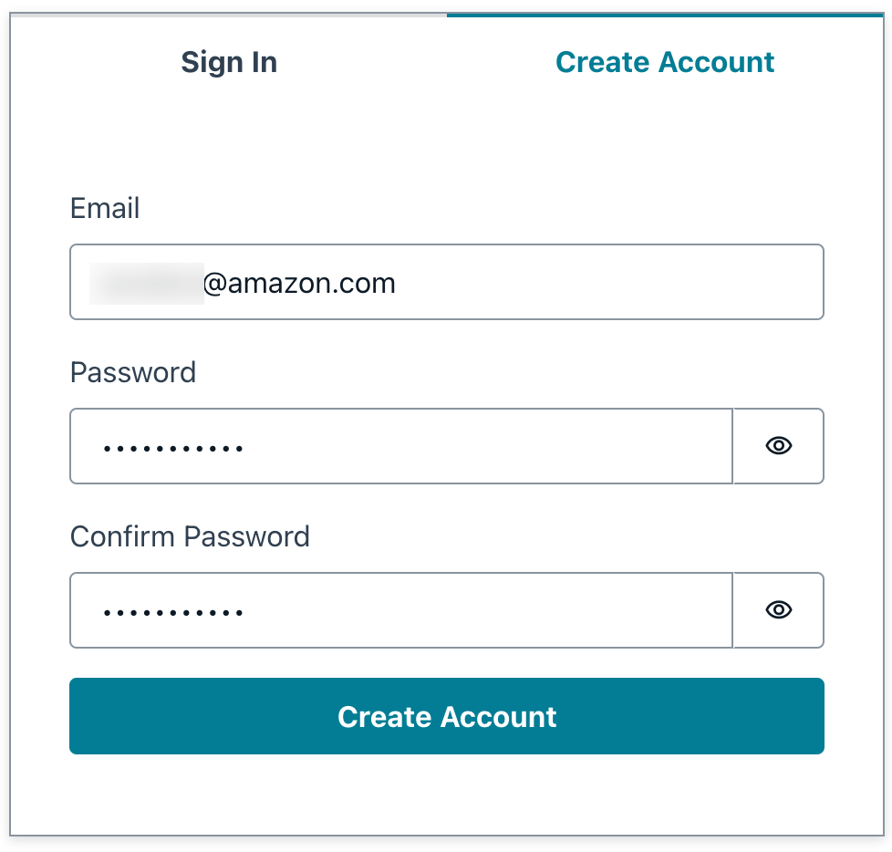
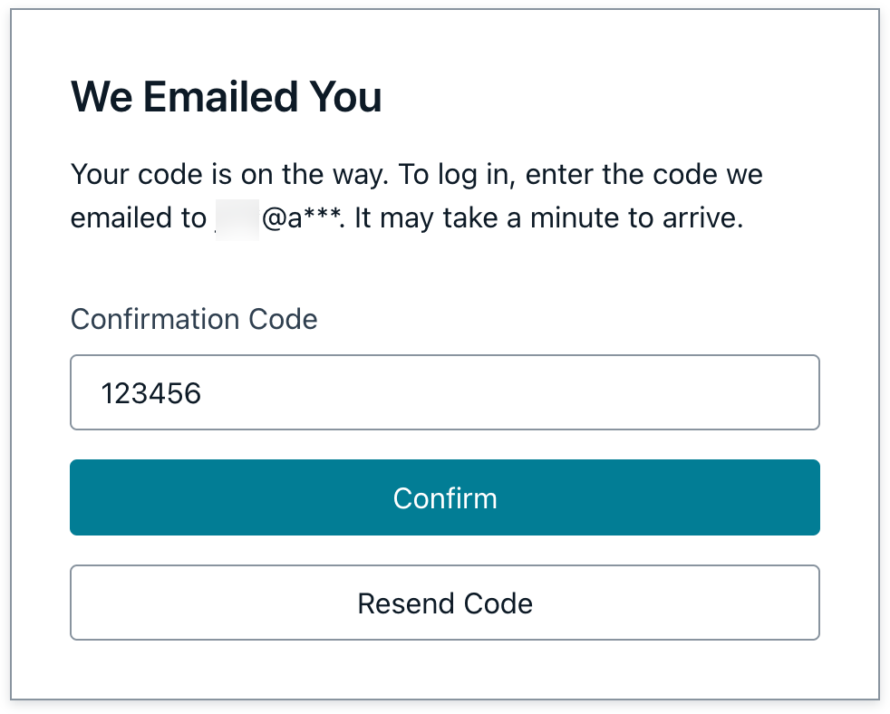

## Build a Serverless Web Application using Generative AI

A full‑stack React + AWS Amplify Gen 2 application that lets users authenticate, enter ingredients, and receive an AI‑generated recipe. The app uses Amplify for auth and hosting, AppSync for the API, Lambda for server logic, and Amazon Bedrock for foundation models.

<!-- Hero banner (add your screenshot to docs/hero.png) -->
<p align="center">
  
</p>

### Tech Stack
- **Frontend**: React + TypeScript + Vite 5, Amplify UI for Auth.
- **Auth**: Amazon Cognito via Amplify `defineAuth` with email verification (custom subject/body).
- **API**: Amplify Data (AppSync GraphQL) + custom resolver to call a Lambda.
- **AI**: Lambda integrates with Amazon Bedrock to generate recipes from ingredients.
- **Hosting/CI**: Amplify Hosting with `amplify.yml` for backend + frontend build.

---

## Architecture
- Users sign up/sign in with Cognito (Amplify Auth).
- Frontend calls API using Amplify Data client (`generateClient`).
- AppSync resolves a custom query (e.g., `askBedrock`) to a Lambda function.
- Lambda calls Amazon Bedrock and returns the generated recipe text.

<p align="center">
  
</p>

---

## User Authentication Through Email 

- User will authenticate through the Email by Generating Code.

<p align="center">
  
  
</p>

---

## Live Demo of Project

- Here User is querying the recipies through the ingridients as an input.

<p align="center">
  
</p>

---

## Prerequisites
- Node.js 18 (this repo pins Vite to a Node 18‑compatible version).
- An AWS account with permission to use Amplify, Cognito, AppSync, Lambda, S3, and Bedrock.
- AWS credentials locally (via SSO or access keys). See Setup below.

---


## Local development (first‑time setup)

1) Install dependencies
```bash
npm ci
```

2) Configure an AWS profile (recommended: SSO)
```bash
npx ampx configure profile
```
- Choose browser sign‑in (or your org SSO), pick account/role/region, name it (e.g., `amplify-sandbox`).

3) Start a one‑time sandbox deploy (creates cloud resources in an isolated dev space)
```bash
npx ampx sandbox --profile amplify-sandbox --once
```
This command also writes the app’s configuration file `amplify_outputs.*` into your project directory.

4) Run the app locally
```bash
npm run dev
```
Open the printed local URL. Create an account, verify email, and try generating a recipe.

---

## Deployment with Amplify Hosting (CI/CD)
1) Push your code to GitHub.
2) In Amplify Console, connect the repo/branch. This repo includes an `amplify.yml` that:
   - Installs backend deps and runs `npx ampx pipeline-deploy`.
   - Builds the frontend using Vite and deploys `dist/`.

Node version compatibility is handled by using Vite 5 (works on Node 18). If you upgrade Vite to 7+, ensure the build image runs Node 20+ or pin your own runtime.

---

## Auth configuration
`amplify/auth/resource.ts` uses `defineAuth` with custom email verification:
- Subject: “Welcome to the AI-Powered Recipe Generator!”
- Body includes a generated code via `createCode()`.

Users can sign up with email, receive a code, then sign in. The frontend imports Amplify UI styles and calls `Amplify.configure(outputs)` using the generated `amplify_outputs.json`.

---

## Data/API and AI integration
- `amplify/data/resource.ts` declares the Data schema and authorization modes.
- A custom query (referenced in the UI as `amplifyClient.queries.askBedrock`) is resolved by a Lambda that invokes Amazon Bedrock to generate recipe text.
- The Data client is created via:
```ts
import { generateClient } from "aws-amplify/data";
const client = generateClient<Schema>({ authMode: "userPool" });
```

---

## Scripts
- `npm run dev` – start Vite dev server.
- `npm run build` – type‑check + Vite build (output in `dist/`).
- `npm run preview` – preview built app.

---

## Cleanup
To delete the sandbox resources when you’re done developing:
```bash
npx ampx sandbox delete --profile <your-profile>
```
To tear down Amplify Hosting resources, delete the app from the Amplify Console.

---